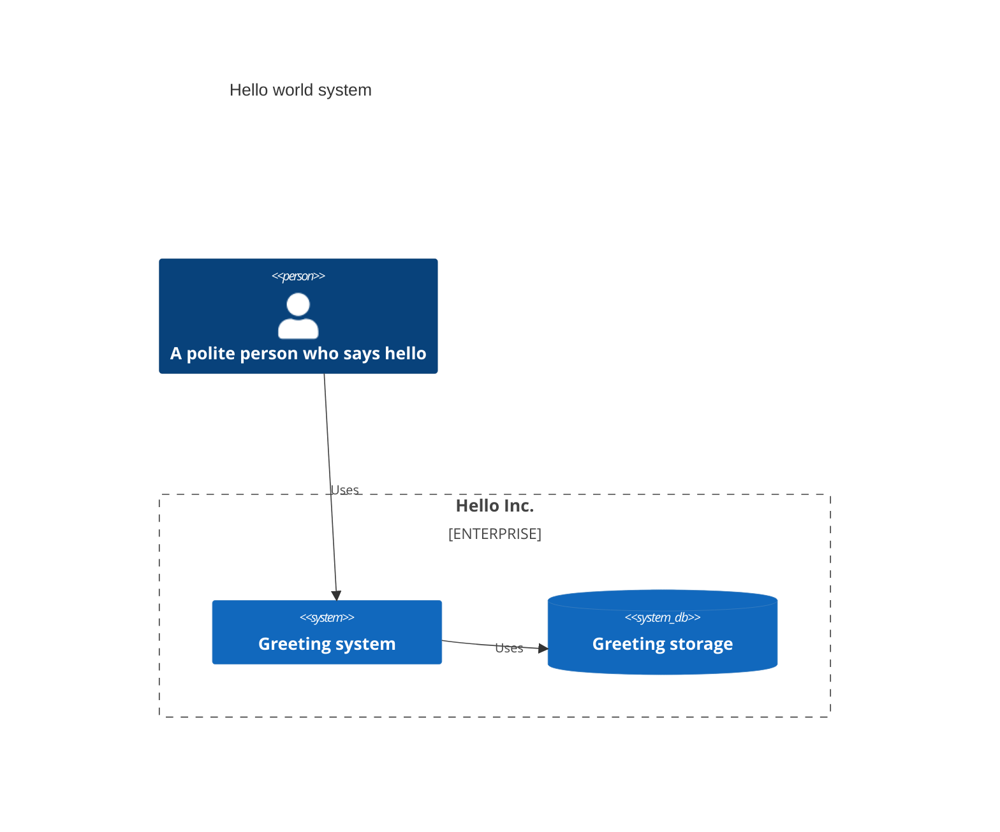

# CDK architecture primitives for API-first event driven solutions

What if the architecture of your solution was directly reflected in your code?
What if you could define business logic without tying it to a specific infrastructure approach?
What if you could trivially swap infrastructure components and vendors without sacrificing capabilities?
What if the API consumers would use the same interface definitions as the API themselves?
What if your code could effortlessly and automatically present itself as C4's system, container and deployment diagrams?

This JavaScript library attempts to address exactly that with just one assumption — a robust and scalable architecture must be based on messaging (API) and events.

Let's have a look at a simple service-based hello world where a user can send a greeting (that will be saved for posterity) and receives a greeting back.

```typescript
// Architecture container
export const arch = new Architecture('Hello Inc.');

// Architectural something that can store greetings
export const jsonStore = new JsonStore<Greeting>(arch, 'Greeting storage');

// Function that will receive users' hellos. Aware of the greeting storage.
const helloHandler = async (name: string) => {
  const res = await jsonStore.store('greeted', { when: Date.now(), name });
  return `Hello, ${name}!`;
}

// Convenience function that returns stored hellos. Also aware of the greeting storage.
const listHellos = () => {
  const res = jsonStore.get('greeted');
  return res;
}

// Architectural functions. Something that can be called, e.g. individual APIs
const helloFunction = new Function(arch, 'hello-handler', helloHandler);

const listFunction = new Function(arch, 'list-handler', listHellos);

// An API container
export const api = new ApiContainer(arch, 'Greeting system', {
  hello: { path: 'POST /v1/api/hello/{name}', handler: helloFunction },
  hellos: { path: 'GET /v1/api/hellos', handler: listFunction }
});


```

So we have an API with two endpoints and a persistent storage for JSON documents.
Here's a crude C4 system representation:



Why does it matter, one might ask?

Well, the thing is that at this stage we have a solution that has its system scope explicitly defined and on top of that, the complete business logic that has one technological decision — JavaScript. A thing that can be run virtually anywhere. Those functions can be deployed anywhere — as Lambda on AWS, on K8s, in Azure, as workers on Cloudflare, run on bare metal. The greeting storage? Same story. Dynamo, Postgres, Cloudflare KV. Sky is the limit. Just write some generic glue code that connects A to B.

Which means that with this approach we can 

- On one hand, refactor the system architecture and business logic without seriously affecting the infrastructure.
- Refactor the infrastructure without impacting the business logic. DynamoDB became too expensive? Replace it with files stored in S3. 

Here under the packages/example you can see two different infra implementations, one for local docker deployment, another for Cloudflare.